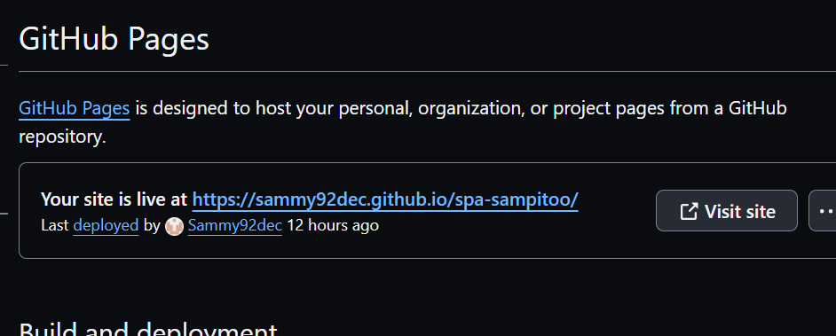

#  Spa Sampito

Spa Sampito is a site designed to highlight how important to immerse yourself in a world of relaxation and rejuvenating experiences. The site will give you a glimpse into our unwinding services to a path of holistic wellness. Tailored for your serenity, our website aims to be the go-to destination for those seeking blissful escapes.

The live link - <https://sammy92dec.github.io/sampito/>

## CONTENTS

- [ Spa Sampito](#-spa-sampito)
  - [CONTENTS](#contents)
- [UX](#ux)
  - [User Stories](#user-stories)
    - [Target Audience](#target-audience)
  - [Strategy](#strategy)
  - [Scope](#scope)
  - [Structure](#structure)
  - [Skeleton](#skeleton)
  - [Surface](#surface)
- [Features](#features)
  - [Existing Features](#existing-features)
    - [Features Left to Implement](#features-left-to-implement)
- [Technologies Used](#technologies-used)
  - [Testing](#testing)
    - [Validator Testing](#validator-testing)
  - [Deployments](#deployments)
    - [How to Fork](#how-to-fork)
  - [Credits](#credits)
    - [Code Used](#code-used)
    - [Content](#content)
    - [Media](#media)
    - [Acknowledgments](#acknowledgments)

# UX
## User Stories

- To show what the Spa offer for services.
- Easy to navigate between pages
- Soothing colors to reflect the feeling of calmness.
- To easily signup to the facility
-

### Target Audience

- Working class,Whoever is in need of a break and to have a healthier routine mindfully or physically.Day visits is also avaliable

## Strategy

## Scope

## Structure

## Skeleton

## Surface

Most of the website color is created using HEX.
The main color used is Khaki #C1A894 giving the whole background a warm color.Darker colors on the header and the footer for more earthy effect #8C6042 and #A37150. The purpose was to have a calmness feeling through the website which will help to reflect how it will actually be in the spa.I used "https://coolors.co/3a3a3a-8c6042-a37150-c1a894-a7bbec" to generate my color palette.

# Features

The website is comprised of 3 pages which are extended from a base template.

* Home page
* Signup page
* Membership page

## Existing Features

- __Navigation Bar__

  - Featured on all two pages, the full responsive navigation bar includes links to the Logo, Home page and  Sign Up page and is identical in each page to allow for easy navigation.
  - This section will allow the user to easily navigate from page to page across all devices without having to revert back to the previous page via the ‘back’ button.

- __The landing page image__

  - The landing includes a text to what the spa offers and as well as a glimpse of the facility by adding pictures. 
  - This section introduces the user Spa Sampito with an eye catching limited picture to grab their attention and to wanting more.

- __Membership section__

  - This section will allow the user to see the membership that we offer and whats included with each membership.
  - This section will be updated whenever there is a change with the offers to keep the user up to date.

- __The Footer__

  - The footer section includes links to the relevant social media sites for Spa Sampitoo. The links will open to a new tab to allow easy navigation for the user.
  - The footer is valuable to the user as it encourages them to keep connected via social media

- __The Sign Up Page__

- The Signup will help the user to register with the spa and be able to choose which membership they are interested with.The user will be asked to submit their full name and email address.

### Features Left to Implement

- To setup a gallery page to include real clients images and experiences at Spa Sampitoo.

# Technologies Used

- HTML
- CSS 
  
Also made use of:
- Font Awesome
- Google Fonts
- HTML Validator
- CSS Validator
  

## Testing

Testing was completed on multiple devices for resposiveness.All links and possible click throughs were also tested.

| Feature | Description | Steps | Outcome |
| --- | --- | --- | --- |
| Homepage Content | Displays relevant information on the homepage. | N/A | Homepage shows latest content and updates. |
| Signup Form | Includes Signup form for user to join. | 1. Fill out user information. | Submission successful, user gets a Thank You page and redirect. |
| Responsive Design | Ensures the website works well on all devices. | N/A | Website layout adjusts to different screen sizes. |
| Navigation Menu | Provides easy navigation through the site. | 1. Click to signup | Smooth navigation, correct pages are loaded. |
| Social Media Integration | Connects the website with social media platforms. | 1. Share a page on social media. | Page is shared with the correct link and image. |

### Validator Testing

- HTML
  - No errors were returned when passing through the official [W3C validator](https://validator.w3.org/nu/?doc=https%3A%2F%2Fcode-institute-org.github.io%2Flove-running-2.0%2Findex.html)
  
- CSS
  - No errors were found when passing through the official [(Jigsaw) validator](https://jigsaw.w3.org/css-validator/validator?uri=https%3A%2F%2Fvalidator.w3.org%2Fnu%2F%3Fdoc%3Dhttps%253A%252F%252Fcode-institute-org.github.io%252Flove-running-2.0%252Findex.html&profile=css3svg&usermedium=all&warning=1&vextwarning=&lang=en#css)
  
- Lighthouse
  

## Deployments

This section is the process to go through to deploy the project to a hosting platform (e.g. GitHub)

- The site was deployed to GitHub pages. The steps to deploy are as follows:
  - In the GitHub repository, navigate to the Settings tab.
  - Click Pages.
  - In the build and deployment choose main branch to deploy and click save.
  - Once the main branch has been selected, the page will be automatically refreshed with a detailed ribbon display to indicate the successful deployment or manually refresh the page.
  - You will be able to confirm the website is deployed at the top part of pages.Like the image below.
  
  

The live link - <https://sammy92dec.github.io/sampito/>

### How to Fork

Steps to fork Sampito project :-

* Go to Github.com,navigate to the Sammy92dec/sampito repository.
* In the top-right corner of the page,Click fork.
 
* Under "Owner," select the dropdown menu and click an owner for the forked repository.
* By default, forks are named the same as their upstream repositories. Optionally, to further distinguish your fork, in the "Repository name" field, type a name.
* Optionally, in the "Description" field, type a description of your fork.
* Optionally, select Copy the DEFAULT branch only.
* Click Create fork.

## Credits

### Code Used

Most of the code is taken from my old project submission from the code insistue.[Sammy92dec/spa-sampito](https://sammy92dec.github.io/spa-sampito/) I had issue with adding on the same webpage so I created a new one.

### Content

- Content for this project was written by Samrawit Tekheste 
- Navigation attribute was taken from the tutorial video in code institute "Love Running" [Code Insistute](https://codeinstitute.net/se/)

### Media

- The photos used on the home and sign up page are from other open source site.
- All screenshots of code used in this README were taken by myself from my own milestone project repositories.
- Favicon logo created at Favicon.io. I have chosen an illustration of waves as it fit the theme of my site.[Favicon](https://favicon.io/)
- The font used was taken from [Google Fonts](https://fonts.google.com/specimen/Cinzel).
- The icons used for the footer were taken from [Font Awesome](https://fontawesome.com/icons?d=gallery).

### Acknowledgments

- [Kera-Cudmore](https://github.com/kera-cudmore/BookWorm)- for providing her README templates for education reasons.
  
- [Bytegard] (https://www.youtube.com/watch?v=TW6unH7XBAE) a channel in youtube for flex and other tutorials. Really helped me make this page nicer.
